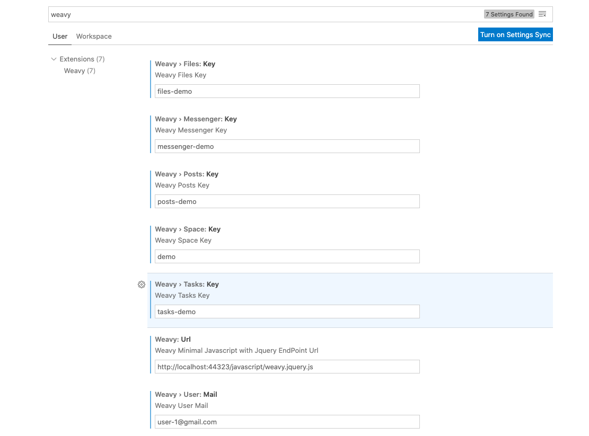

# Veavy'S Code

Veavy'S Code Extension for Visual Studio Code. This repository contains the visual studio code extension for [weavy](https://www.weavy.com/)

## Hackathon Presentation

Powerpoint presentation - [Veavy'S Code](./docs/ppt/pptx)

### Extension of this idea:
Build an electron cross platform desktop app which is very helpful for corporate employees/students as a one stop solution for messaging, document collaboration, file sharing etc.. Instead of having 3-4 desktop apps for each purpose, you can have a single app consisting of all weavy's features which is a lot less development time, cross platform ready and easy to use.


## What's [Weavy](https://www.weavy.com/)?

The complete white-label framework for in-app messaging and collaboration. Different features of weavy are as follows:

1. Instant Messaging
2. Secure File Sharing
3. Activity Feeds
4. To-Do Tasks

------
# CAUTION: THIS IS A PROTOTYPE WITH CLIENT SIDE JWT TOKEN AUTHENTICATION. DO NOT RUN IN PRODUCTION

## Mandatory Prerequisites before installation

1. Download and install Visual Studio Code - [Download Link](https://code.visualstudio.com/download)
2. Install the latest version of [Nodejs](https://nodejs.org/en/)
3. Install [npm](https://www.npmjs.com/get-npm)
4. Install [Git](https://www.atlassian.com/git/tutorials/install-git)
5. Install [TypeScript](https://www.typescriptlang.org/download)

## Installing in your local environment:

The steps to install in your local environment are as follows:

1. Get the [Veavy'S Server](https://github.com/Better-Boy/veavy-server) Up and Running  
   **Caution: Mention the clientId as "clientId" and clientSecret as "clientSecret" in manage connections**
1. Create a new space by name "demo" in weavy
   
1. Clone this repository using the following command
   ```bash
   git clone https://github.com/Better-Boy/veavy-code
   ```
1. Change the directory to veavy-code
    ```bash
    cd veavy-code
    ```
1. Open the code in visual studio code
    ```bash
    code .
    ```
1. Run `npm install`
1. Click "Start Debugging" from the Run Menu or F5
   
1. A new Vscode Window opens up with the extension loaded

## Veavy's Code Settings:
There are certain settings that need to be done before using the extension. They are as follows:



1. Weavy: Url - Weavy Minimal Javascript with Jquery EndPoint Url - (Mandatory for all apps)
2. Weavy › User: Mail - Weavy User Mail - (Mandatory for all apps)
3. Weavy › Space: Key - Weavy Space Key - (Mandatory for all apps)
4. Weavy › Files: Key - Weavy Files Key - (Mandatory for files command)
5. Weavy › Messenger: Key - Weavy Messenger Key - (Mandatory for messenger command)
6. Weavy › Posts: Key - Weavy Posts Key - (Mandatory for posts command)
7. Weavy › Tasks: Key - Weavy Tasks Key - (Mandatory for tasks command)

In order to open the settings, click on the settings icon in bottom left corner of the visual code. Click on the settings tab.


## Veavy'S Code Usage

Weavy has different apps for different purpose. Every app in the extension can be opened using a command. There are 4 different apps, hence 4 different commands.

**Before invoking any of the commands, please fill the different settings mentioned above**


1. [Files App](./docs/apps/files-app.md)
1. [Messenger App](./docs/apps/messenger-app.md)
1. [Posts/Feeds App](./docs/apps/posts-app.md)
1. [Tasks App](./docs/apps/tasks-app.md)

## Known Issues:
1. Weavy javascript url not able to load
2. Authentication successful for Unknown User - This is due to client side jwt authentication
3. Authorization Error
4. Automatic creation of unknow spaces

## Improvements to be done
1. Server side JWT authentication
2. Better Error Handling